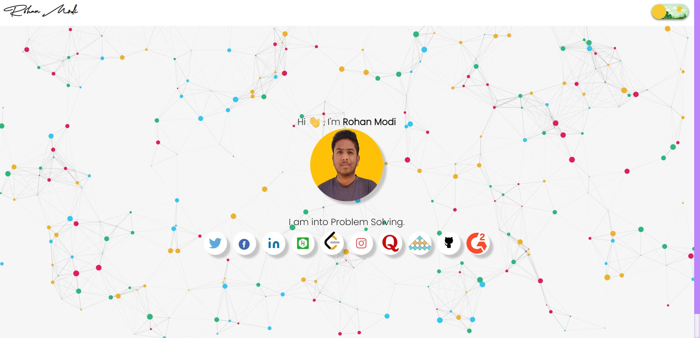
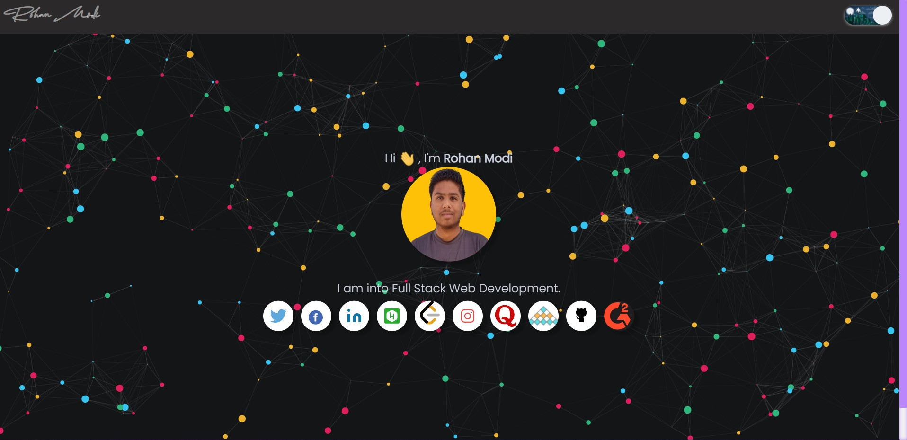

# [RohanContactWebsite](https://contact-rohan.netlify.app/) ⭐

&nbsp;
&nbsp;
&nbsp;
&nbsp;<br/>


[](https://contact-rohan.netlify.app/)
[](https://github.com/ROHAN842/Portfolio_Contact_Single_Page_Website)

## Overview 👀




- Contact 📞 me anytime through my social media handles and coding platform profiles. 

## What is Portfolio_Contact_Single_Page_Website? 🤔

#### It is a website consisting all of my coding platform sites profile as well as social media handles profile links.


## How it works? 🤔
- **Open the website [https://contact-rohan.netlify.app/](https://contact-rohan.netlify.app/)**
- **User can easily see my various social media handles profile badges and coding platforms profile badges with links.**
- **Upon tapping to any of profile user can easily sent me connection request as well as folllow me, inorder to stay tuned.**

## Dependencies 🗃

- [Bootstrap](https://getbootstrap.com/docs/3.3/getting-started/) - **Frontend Framework**

## Run Locally 💻

```
> Clone the repo
    >> For Windows: Git Bash
    >> For Linux: Terminal
    >> git clone https://github.com/ROHAN842/Portfolio_Contact_Single_Page_Website.git
    >> cd Portfolio_Contact_Single_Page_Website
> Visit the website while opening it on the live server
    
```
